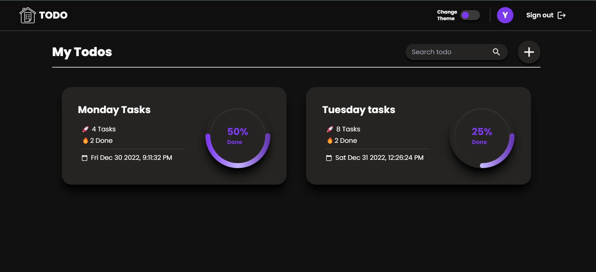
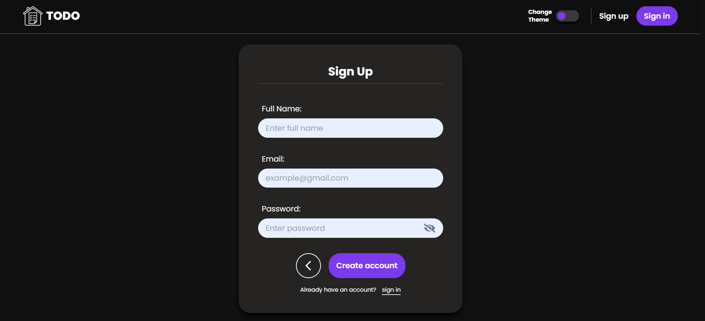
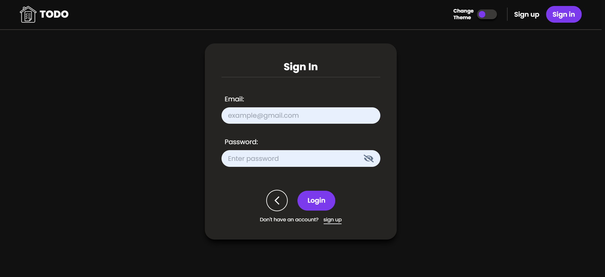
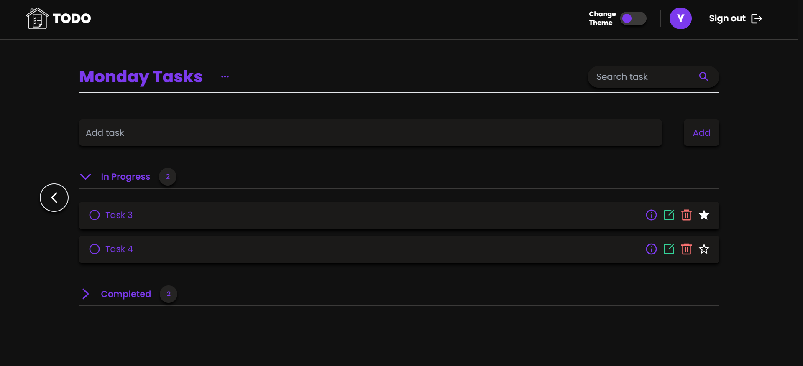

# Todo app

- This is a fullstack project. In this project I have made a **Todo App** with MERN, which can perform all CRUD operations.

- I have hosted this website on Render, please find the link below:

  

- Click the link below to see backend repository:

  

---

## 🚀 Features

- Authentication
- Create, edit, delete and read todos.
- Create, edit, delete and read tasks.
- Mark important tasks.
- Progress bar to see your progression.
- Responsive for small and medium screens.
- Todo and tasks timestamp.
- Available in Dark and light mode.
- Can set todo theme.
- Search bar to search todos and tasks.

---

## 🛠 Skills learned

- To use mongodb and mongoose.
- To use react router dom.
- To use react hooks.
- To deploy backend.

---

## 💻 Technologies used

- React.js for frontend.
- React router dom for client side routing.
- Express.js and Node.js for backend.
- mongoose and mongodb for database.
- Framer motion for some animations.

---

## 🎥 Screenshot

---

## 👨‍💻 About Me

### Hey, I am Yasir lambawala

- I am a frontend developer from Gujarat. I have done my Btech at GTU university and I am currently learning backend-development.

- Connect with me on:
  - [Linkedin](https://www.linkedin.com/in/yasir-lambawala-2b216a1b9/)
  - [Instagram](https://www.instagram.com/web_dev_yasir/)

---

## Feedback

- If you have any feedback, please reach me at lambawalay@gmail.com
